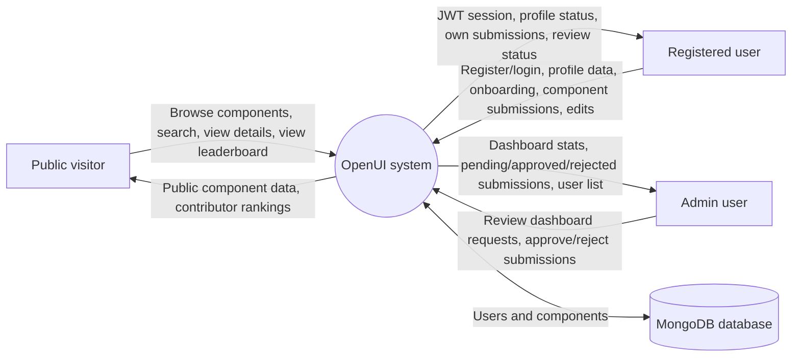

# OpenUI Data Flow Diagram

This document describes the main data flows in OpenUI, a React/Vite frontend backed by an Express/Mongoose API and MongoDB.

## Level 0: Context Diagram

## Level 1: Main Application Data Flow

```mermaid
flowchart TB
    Visitor[Public visitor]
    User[Registered user]
    Admin[Admin user]
    Browser[React frontend]

    AuthAPI((Auth process))
    ComponentAPI((Component catalog and submission process))
    AdminAPI((Admin review process))
    LeaderboardAPI((Leaderboard process))
    AuthGuard((JWT auth and role middleware))

    Users[(D1 Users collection)]
    Components[(D2 Components collection)]
    TokenStore[(D3 Browser localStorage token)]

    Visitor -->|Open pages, search terms, selected component slug| Browser
    Browser -->|GET /api/components, GET /api/components/:slug| ComponentAPI
    ComponentAPI -->|Approved component queries| Components
    Components -->|Approved components and author details| ComponentAPI
    ComponentAPI -->|Component lists/details| Browser
    Browser -->|Rendered gallery, details, live preview| Visitor

    Visitor -->|Signup/login form data| Browser
    User -->|Signup/login form data| Browser
    Browser -->|POST /api/auth/register or /login| AuthAPI
    AuthAPI -->|Find/create user, hashed password, role, profile flags| Users
    Users -->|User record and password hash| AuthAPI
    AuthAPI -->|JWT and user summary| Browser
    Browser -->|Store JWT| TokenStore
    Browser -->|Authenticated UI state| User

    User -->|Profile and onboarding data| Browser
    Browser -->|Bearer JWT, POST /api/auth/profile or /onboard| AuthGuard
    AuthGuard -->|Verified user id| AuthAPI
    AuthAPI -->|Update profileData, hasProfile, onboarded| Users
    Users -->|Updated user| AuthAPI
    AuthAPI -->|Updated account state| Browser

    User -->|New component or edit form data| Browser
    Browser -->|Bearer JWT, POST /api/components or PUT /api/components/:id| AuthGuard
    AuthGuard -->|Verified author/admin| ComponentAPI
    ComponentAPI -->|Create/update submission, status pending unless admin| Components
    Components -->|Saved component submission| ComponentAPI
    ComponentAPI -->|Submission result/status| Browser
    Browser -->|Own submissions and status| User

    User -->|View profile submissions| Browser
    Browser -->|Bearer JWT, GET /api/components/me| AuthGuard
    AuthGuard -->|Verified user id| ComponentAPI
    ComponentAPI -->|Find components by authorId| Components
    Components -->|User-owned components| ComponentAPI
    ComponentAPI -->|Submission list| Browser

    Visitor -->|Leaderboard page request| Browser
    User -->|Leaderboard page request| Browser
    Browser -->|GET /api/leaderboard| LeaderboardAPI
    LeaderboardAPI -->|Read approved components with author data| Components
    Components -->|Approved component authors| LeaderboardAPI
    LeaderboardAPI -->|Sorted users by approved component count| Browser

    Admin -->|Dashboard/review actions| Browser
    Browser -->|Bearer JWT, GET /api/admin/dashboard| AuthGuard
    Browser -->|Bearer JWT, POST /api/admin/approve or /reject| AuthGuard
    AuthGuard -->|Verified admin user| AdminAPI
    AdminAPI -->|Read counts, submissions, user list| Components
    AdminAPI -->|Read all users| Users
    Components -->|Pending/approved/rejected submissions| AdminAPI
    Users -->|User records| AdminAPI
    AdminAPI -->|Set component status approved/rejected| Components
    AdminAPI -->|Dashboard data and action result| Browser
    Browser -->|Review lists and status feedback| Admin
```

## Main Processes

| Process | Backend route/module | Purpose |
| --- | --- | --- |
| Auth process | `backend/src/routes/auth.routes.ts` | Registers users, logs users in, returns `/me`, updates profile data, and marks onboarding complete. |
| Component catalog and submission process | `backend/src/routes/components.routes.ts` | Serves approved components publicly, serves a user's own submissions, creates submissions, and edits components. |
| Admin review process | `backend/src/routes/admin.routes.ts` | Provides dashboard data and changes component submission status to approved or rejected. |
| Leaderboard process | `backend/src/routes/leaderboard.routes.ts` | Builds rankings from approved components grouped by author. |
| JWT auth and role middleware | `backend/src/middleware/auth.middleware.ts` | Verifies bearer tokens, loads the current user, and restricts admin routes. |

## Data Stores

| Store | Location | Key data |
| --- | --- | --- |
| D1 Users collection | MongoDB via `backend/src/models/User.ts` | Name, email, hashed password, role, profile status, onboarding status, profile links, creation date. |
| D2 Components collection | MongoDB via `backend/src/models/Component.ts` | Title, slug, description, category, code, author reference, tags, dependencies, usage, theme support, review status, creation date. |
| D3 Browser localStorage token | Client browser via `frontend/src/context/AuthContext.tsx` and `frontend/src/lib/api.ts` | JWT used by Axios as the `Authorization: Bearer ...` header for protected API requests. |

## Key Data Flows

| Flow | Data moved |
| --- | --- |
| Registration/login | Name, email, password from frontend to API; hashed password and user record in MongoDB; JWT and user summary back to frontend. |
| Session restore | JWT from localStorage to `/api/auth/me`; current user data back to the frontend. |
| Profile/onboarding | Profile fields or onboarding completion flag from frontend to API; updated user document stored in MongoDB. |
| Public browsing | Search terms or slugs from frontend to API; approved component records and author summaries back to the frontend. |
| Component submission/editing | Component metadata, source code, tags, dependencies, usage, and theme support to API; pending/approved component records stored in MongoDB. |
| Admin review | Dashboard and review requests with admin JWT; submission lists and status changes between API and MongoDB. |
| Leaderboard | Approved component records read from MongoDB; API returns users sorted by approved contribution count. |

