# Entity-Relationship (ER) Diagram

This document describes the Entity-Relationship (ER) design of the **OpenUI** application. The system uses **MongoDB** as its primary document-oriented NoSQL database and Mongoose as the Object-Document Mapper (ODM) to enforce schemas and relationships at the application layer.

---

## 1. ER Diagram (Chen Notation)

The diagram below uses **Chen Notation** (Rectangles for Entities, Ovals for Attributes, and Diamonds for Relationships), which is the standard format required for academic and project reports.

```mermaid
flowchart TD
    %% Styling
    classDef entity fill:#1e293b,stroke:#3b82f6,stroke-width:2px,color:#fff;
    classDef attribute fill:#f8fafc,stroke:#64748b,stroke-width:1px,color:#0f172a;
    classDef relationship fill:#1e1b4b,stroke:#818cf8,stroke-width:2px,color:#fff;
    
    %% Entities
    USER[USER]:::entity
    COMPONENT[COMPONENT]:::entity
    CATEGORY[CATEGORY]:::entity

    %% User Attributes
    u_id(("<u>_id (PK)</u>")):::attribute
    u_name(("name")):::attribute
    u_email(("email (UK)")):::attribute
    u_pass(("password")):::attribute
    u_role(("role")):::attribute
    u_hasProfile(("hasProfile")):::attribute
    u_onboarded(("onboarded")):::attribute
    u_createdAt(("createdAt")):::attribute
    u_profile(("profileData")):::attribute

    %% ProfileData Attributes (embedded)
    bio(("bio")):::attribute
    avatar(("avatar")):::attribute
    web(("website")):::attribute
    git(("github")):::attribute

    %% Component Attributes
    c_id(("<u>_id (PK)</u>")):::attribute
    c_title(("title")):::attribute
    c_slug(("slug (UK)")):::attribute
    c_desc(("description")):::attribute
    c_cat(("category")):::attribute
    c_code(("code")):::attribute
    c_prev(("previewImage")):::attribute
    c_auth(("authorId (FK)")):::attribute
    c_tags(("tags")):::attribute
    c_deps(("dependencies")):::attribute
    c_usage(("usage")):::attribute
    c_theme(("themeSupport")):::attribute
    c_status(("status")):::attribute
    c_createdAt(("createdAt")):::attribute

    %% Category Attributes
    cat_id(("<u>_id (PK)</u>")):::attribute
    cat_name(("name")):::attribute
    cat_slug(("slug (UK)")):::attribute

    %% Connections for USER
    USER --- u_id
    USER --- u_name
    USER --- u_email
    USER --- u_pass
    USER --- u_role
    USER --- u_hasProfile
    USER --- u_onboarded
    USER --- u_createdAt
    USER --- u_profile

    %% Connections for profileData
    u_profile --- bio
    u_profile --- avatar
    u_profile --- web
    u_profile --- git

    %% Connections for COMPONENT
    COMPONENT --- c_id
    COMPONENT --- c_title
    COMPONENT --- c_slug
    COMPONENT --- c_desc
    COMPONENT --- c_cat
    COMPONENT --- c_code
    COMPONENT --- c_prev
    COMPONENT --- c_auth
    COMPONENT --- c_tags
    COMPONENT --- c_deps
    COMPONENT --- c_usage
    COMPONENT --- c_theme
    COMPONENT --- c_status
    COMPONENT --- c_createdAt

    %% Connections for CATEGORY
    CATEGORY --- cat_id
    CATEGORY --- cat_name
    CATEGORY --- cat_slug

    %% Relationships (Diamonds)
    Has{Has}:::relationship
    Authors{Authors}:::relationship
    Contains{Contains}:::relationship

    %% Relationship Connections with Cardinalities
    USER ===|"1"| Has ===|"1"| u_profile
    USER ===|"1"| Authors ===|"N"| COMPONENT
    CATEGORY ===|"1"| Contains ===|"N"| COMPONENT
```

---

## 2. Entity Descriptions and Attributes

### 2.1 USER (`users` Collection)
Stores authentication details, permissions (roles), state flags for onboarding, and nested profile metadata.
* **Source Reference:** [User.ts](file:///d:/coding/clgproject/OpenUI/backend/src/models/User.ts)
* **Design Strategy:** Represents a registered user. The profile data is embedded inside each user document since user profiles have a 1:1 relationship with users, have low update frequency, and are always queried together with basic user info.

| Attribute | BSON Type | Constraints & Validations | Description |
| :--- | :--- | :--- | :--- |
| `_id` | `ObjectId` | Primary Key, Auto-generated | The unique identifier for the user. |
| `name` | `String` | Required | Full name of the user. |
| `email` | `String` | Required, Unique, Indexed | Email address used for registration and login. |
| `password` | `String` | Optional | Hashed password. Optional to accommodate potential third-party OAuth flows. |
| `role` | `String` | Enum: `["user", "admin"]`, Default: `"user"` | Specifies access levels. `admin` can approve/reject component submissions. |
| `hasProfile` | `Boolean` | Default: `false` | Indicates whether the user has created their profile details. |
| `onboarded` | `Boolean` | Default: `false` | Indicates whether the user has completed the onboarding flow. |
| `profileData` | `Object` | Nested subdocument (Embedded) | Holds additional social/bio details. |
| `profileData.bio` | `String` | Optional | A short bio written by the user. |
| `profileData.avatar` | `String` | Optional | URL to the user's avatar image. |
| `profileData.website` | `String` | Optional | URL to the user's personal website. |
| `profileData.github` | `String` | Optional | URL to the user's GitHub profile. |
| `createdAt` | `Date` | Default: `Date.now` | Account registration timestamp. |

---

### 2.2 COMPONENT (`components` Collection)
Stores UI components submitted by contributors, including code, documentation, categories, tags, and theme support metadata.
* **Source Reference:** [Component.ts](file:///d:/coding/clgproject/OpenUI/backend/src/models/Component.ts)
* **Design Strategy:** Implements a reference-based relation to `users` via the `authorId` foreign key to prevent the User document from growing unboundedly (avoiding MongoDB's 16MB document size limit).

| Attribute | BSON Type | Constraints & Validations | Description |
| :--- | :--- | :--- | :--- |
| `_id` | `ObjectId` | Primary Key, Auto-generated | Unique identifier for the component. |
| `title` | `String` | Required | Display name of the component. |
| `slug` | `String` | Required, Unique, Indexed | URL-safe identifier (e.g. `primary-button-v2`). |
| `description` | `String` | Required | Short summary explaining what the component does. |
| `category` | `String` | Required | Matches the `slug` of a `Category` document (e.g. `buttons`, `cards`). |
| `code` | `String` | Required | The actual source code of the component. |
| `previewImage` | `String` | Optional | URL of a thumbnail/preview image. |
| `authorId` | `ObjectId` | Required, **Reference: `User`** | Foreign key linking to the `USER` who submitted the component. |
| `tags` | `Array [String]`| Default: `[]` | Searchable keywords (e.g., `modern`, `minimalist`). |
| `dependencies`| `Array [String]`| Default: `[]` | Required external npm packages (e.g., `lucide-react`, `framer-motion`). |
| `usage` | `String` | Default: `""` | Usage instructions and API configuration parameters. |
| `themeSupport` | `String` | Enum: `["both", "light", "dark"]`, Default: `"both"` | Supported styling contexts (essential for high-quality review validation). |
| `status` | `String` | Enum: `["pending", "approved", "rejected"]`, Default: `"pending"` | Moderation workflow state. Admins review pending items. |
| `createdAt` | `Date` | Default: `Date.now` | Submission timestamp. |

---

### 2.3 CATEGORY (`categories` Collection)
Stores pre-defined categories used to classify and organize the UI components.
* **Source Reference:** [Category.ts](file:///d:/coding/clgproject/OpenUI/backend/src/models/Category.ts)
* **Design Strategy:** Keeps categories dynamic so they can be expanded easily in the future without changing database schemas.

| Attribute | BSON Type | Constraints & Validations | Description |
| :--- | :--- | :--- | :--- |
| `_id` | `ObjectId` | Primary Key, Auto-generated | Unique identifier for the category. |
| `name` | `String` | Required | Friendly label (e.g. `"Buttons"`, `"Cards"`). |
| `slug` | `String` | Required, Unique, Indexed | URL-safe name representing the category (e.g., `"buttons"`, `"cards"`). |

---

## 3. Relationships & Cardinalities

1. **USER (1) to PROFILE_DATA (1) [Embedded Relationship]:**
   - Each `USER` has exactly one `profileData` embedded subdocument. 
   - Since the subdocument exists directly inside the `USER` document, deletion of a user automatically cascadingly deletes their profile data.

2. **USER (1) to COMPONENT (N) [Referenced Relationship]:**
   - One user can submit multiple components (One-to-Many).
   - In Mongoose, this is modeled by storing the user's `_id` in the component's `authorId` field.
   - When fetching components, we populate the `authorId` to retrieve the author's details (e.g. `name` and `email`).

3. **CATEGORY (1) to COMPONENT (N) [Logical Relationship]:**
   - Each category contains many components (One-to-Many).
   - Rather than storing `ObjectId` references, components reference categories logically using the category `slug` string in the `category` field. This optimizes simple lookups and catalog routing filtering.

---

## 4. Query Optimization & Indexing

To ensure fast query response times under high read load (e.g., rendering the public gallery or component detail pages), the database is indexed on key query selectors:

1. **`users.email` (Unique Index):** Enhances performance for credential lookups during authentication ($O(1)$) and guarantees email uniqueness.
2. **`components.slug` (Unique Index):** Optimizes the detail retrieval page route (`GET /api/components/:slug`) to prevent full-collection scans.
3. **`categories.slug` (Unique Index):** Facilitates instantaneous category existence verification and routing lookup.
