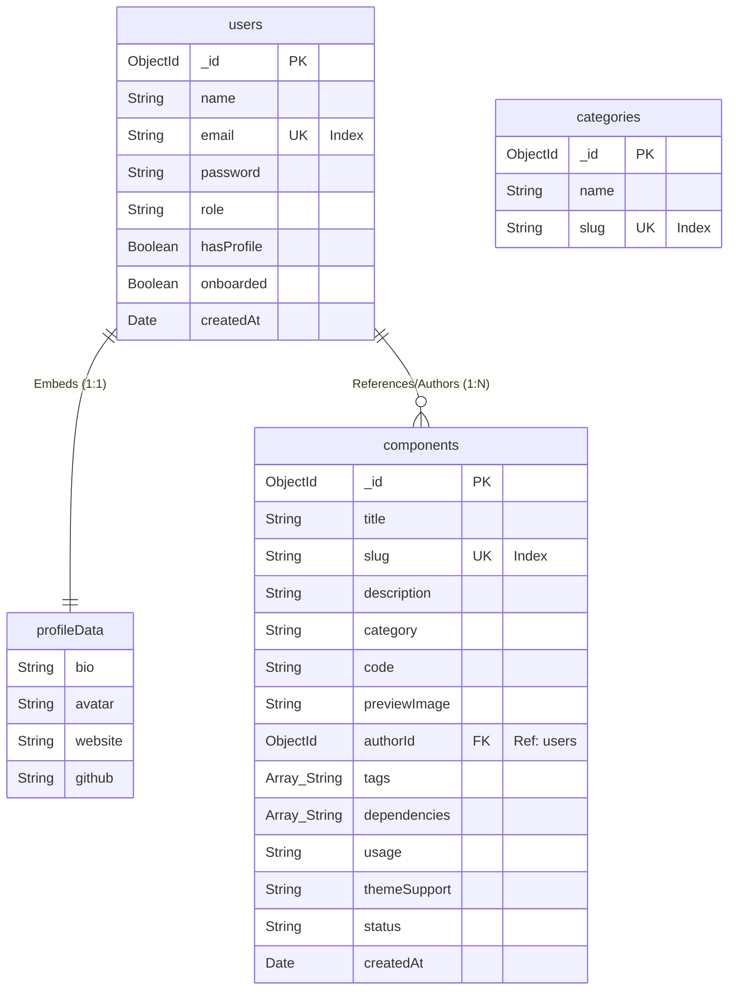

# Chapter 4: Database Design

This chapter describes the database design of the application. The system uses MongoDB, a document-oriented NoSQL database, as its primary data store. Unlike traditional relational database management systems (RDBMS) that store data in tabular formats with fixed columns, MongoDB stores data in flexible, JSON-like BSON documents. This design choice aligns with the hierarchical and dynamic nature of user-submitted UI components.

---

## 4.1 Database Choice and Justification

For a web application managing reusable UI components, MongoDB was selected over traditional relational databases for the following reasons:

1. **Flexible and Dynamic Schema:** UI components have varying properties (e.g., different sets of tags, third-party NPM dependencies, and code languages). A document-oriented database allows storing these list-like properties as native arrays without creating expensive join tables.
2. **Object-Document Mapping (ODM) Alignment:** The application is built using React on the frontend and Node.js/Express on the backend. Storing data as BSON allows seamless data flow (JSON) from the database to the API and directly to the frontend, reducing serialization overhead.
3. **Write and Read Performance:** MongoDB stores embedded documents (like user profile metadata) in a single contiguous block on disk. This permits fetching all user-related data in a single read request, avoiding relational `JOIN` operations that degrade performance at scale.

---

## 4.2 Relational to Document Terminology Mapping

To map relational design principles to the document-oriented paradigm, the following translations are utilized in this design:

| Relational Concept (SQL) | Document Concept (NoSQL) | Implementation in the System |
| :--- | :--- | :--- |
| Table | Collection | Grouping of related documents (e.g., `users`, `components`). |
| Row / Record | Document | A single BSON object within a collection. |
| Column | Field | An attribute-value keypair inside a document. |
| Primary Key | Object ID (`_id`) | Unique 12-byte identifier automatically generated by MongoDB. |
| Foreign Key | Reference ID (`ObjectId`) | A field containing the target document's `_id` to establish links. |
| Table Schema | Mongoose Schema | Enforces structure and validations at the application layer. |

---

## 4.3 Database Schemas (Data Dictionaries)

The database schema is enforced at the application level using Mongoose. The detailed structure of each collection is defined below.

### 4.3.1 `users` Collection
* **Description:** Stores registration details, authorization levels, onboarding status, and nested profile metadata.
* **Design Strategy:** The `profileData` field is designed as an **embedded document (subdocument)** since user profiles are 1:1, have low update frequency, and are always retrieved in conjunction with core user information.

| Field Name | Type | Constraints / Validations | Description |
| :--- | :--- | :--- | :--- |
| `_id` | `ObjectId` | Primary Key, Auto-generated | Unique identifier for the user. |
| `name` | `String` | Required | Full name of the user. |
| `email` | `String` | Required, Unique, Indexed | Email address used for authentication. |
| `password` | `String` | Optional (supports OAuth sign-in) | Hashed password string. |
| `role` | `String` | Enum: `["user", "admin"]`, Default: `"user"` | Access control permissions role. |
| `hasProfile` | `Boolean` | Default: `false` | Indicates if a profile has been initialized. |
| `onboarded` | `Boolean` | Default: `false` | Indicates if onboarding flow is complete. |
| `profileData` | `Object` | Nested / Embedded subdocument | Profile-specific metadata. |
| `profileData.bio` | `String` | Optional | A short biography of the user. |
| `profileData.avatar`| `String` | Optional | URL to the user's profile picture. |
| `profileData.website`| `String` | Optional | URL to the user's personal website. |
| `profileData.github` | `String` | Optional | URL to the user's GitHub profile. |
| `createdAt` | `Date` | Default: `Date.now` | Registration timestamp. |

### 4.3.2 `components` Collection
* **Description:** Stores UI component code templates, configuration parameters, and moderation states.
* **Design Strategy:** Utilizes a **referenced document pattern** via `authorId` to link components to their creators. A 1-to-Many relationship is implemented without embedding, ensuring that user documents do not grow indefinitely and exceed the 16MB MongoDB threshold.

| Field Name | Type | Constraints / Validations | Description |
| :--- | :--- | :--- | :--- |
| `_id` | `ObjectId` | Primary Key, Auto-generated | Unique identifier for the component. |
| `title` | `String` | Required | Display name of the component. |
| `slug` | `String` | Required, Unique, Indexed | URL-safe string representation of the title. |
| `description`| `String` | Required | Explanatory description of the component. |
| `category` | `String` | Required | Category slug/name indicating placement. |
| `code` | `String` | Required | Source code block of the component. |
| `previewImage`| `String` | Optional | URL to preview thumbnail image. |
| `authorId` | `ObjectId` | Required, **Reference: `users`** | Relational link to the creator's user account. |
| `tags` | `Array [String]`| Default: `[]` | Searchable tag list. |
| `dependencies`| `Array [String]`| Default: `[]` | Array of required external packages. |
| `usage` | `String` | Default: `""` | Usage instructions and API parameters. |
| `themeSupport`| `String` | Enum: `["both", "light", "dark"]`, Default: `"both"` | Supported styling themes. |
| `status` | `String` | Enum: `["pending", "approved", "rejected"]`, Default: `"pending"` | Moderation workflow state. |
| `createdAt` | `Date` | Default: `Date.now` | Creation timestamp. |

### 4.3.3 `categories` Collection
* **Description:** Pre-defined categorization directory for classifying components.

| Field Name | Type | Constraints / Validations | Description |
| :--- | :--- | :--- | :--- |
| `_id` | `ObjectId` | Primary Key, Auto-generated | Unique identifier for the category. |
| `name` | `String` | Required | Display name of the category. |
| `slug` | `String` | Required, Unique, Indexed | URL-safe name of the category. |

---

## 4.4 Logical Database Model Diagram

The diagram below represents the collections, fields, and logical relationships in the application database. It highlights both embedded documents (represented as child blocks) and references (represented as logical linkages).

---

## 4.5 Indexing Strategy and Query Optimization

To maintain fast query response times, custom database indices are defined as follows:

1. **`users.email` (Single Field Index):** Since email handles authentication queries, a unique index on this field guarantees constant-time lookup ($O(1)$) and prevents duplicate registrations.
2. **`components.slug` (Single Field Index):** Ensures that fetching single component pages by their slug is optimized and performs zero-scan reads.
3. **`categories.slug` (Single Field Index):** Facilitates instantaneous routing lookup when filtering components by category.
