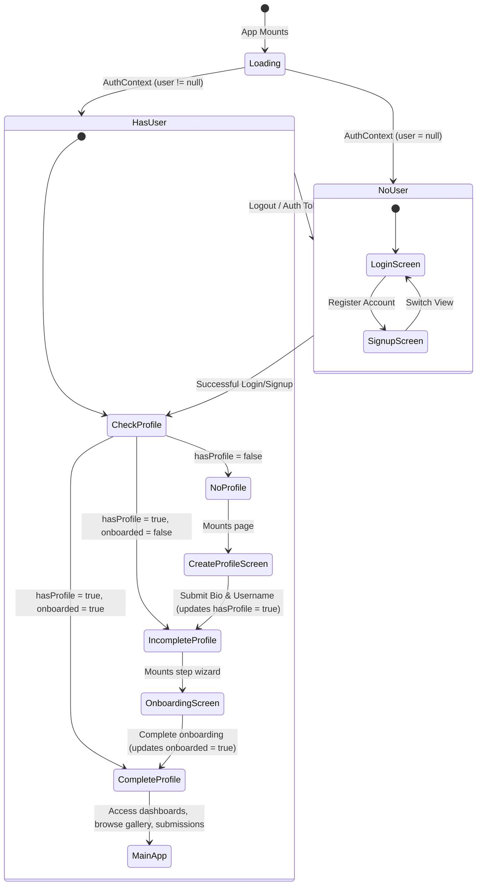

# OpenUI: Project Overview 

This document provides a comprehensive breakdown of the **OpenUI** system architecture, mechanics, routing states, live sandbox rendering, and database structure. It serves as a study sheet and references how each piece operates for this project

---

## 📌 1. Project High-Level Architecture

OpenUI is built on the classic **MERN-like** architecture (using Vite + React + TypeScript instead of standard Create-React-App, and without Node-rendered pages) to support high-performance client-side rendering.

```
       +-------------------------------------------------------------+
       |                        Browser Client                       |
       |  +------------------------+      +-----------------------+  |
       |  |  React + Vite (UI)     | ---> |  react-live Sandbox   |  |
       |  +------------------------+      +-----------------------+  |
       +----------------------------------------------|--------------+
                                                      |
                                             REST APIs (HTTP/JSON)
                                             Authorization JWT
                                                      |
                                                      v
       +-------------------------------------------------------------+
       |                        Backend Server                       |
       |                 Node.js + Express.js API Gateway            |
       |  +-------------------+  +--------------------------------+  |
       |  | JWT & Auth Guard  |  |  Mongoose ODM (MongoDB Models) |  |
       |  +-------------------+  +--------------------------------+  |
       +-----------------------------------------|-------------------+
                                                 |
                                         BSON Queries / Indexes
                                                 |
                                                 v
                                        +-----------------+
                                        |    Database     |
                                        |  MongoDB Atlas  |
                                        +-----------------+
```

### Technical Stack Summary
*   **Frontend**: React (v19), Vite (v8), TypeScript, Tailwind CSS (v4), Framer Motion (for smooth layouts/animations), GSAP (fluid timelines), and Lucide Icons.
*   **Backend**: Node.js, Express.js (v5), TypeScript (`nodemon` / `ts-node` for dev environments).
*   **Database**: MongoDB (NoSQL) accessed via Mongoose ODM.
*   **Authentication**: Stateless authentication using JSON Web Tokens (JWT) stored in browser `localStorage`.
*   **Live Preview Playground**: `react-live` combined with `prism-react-renderer` for compiling and rendering code snippets client-side.

---

## 🔐 2. Authentication & Navigation State Machine

The application uses an authoritative **single source of truth** for routing, keeping a clear lifecycle separation between authenticated states, profile configuration, and onboarding.

### State Transitions Flow chart


### Component Roles
*   **`AuthContext.tsx`**: Manages the core authenticated state (`user`, `profile`, `loading`).
*   **`CentralRouter` (`App.tsx`)**: The central engine that reads `AuthContext` status and decides which layout/routes to render. All authentication failures or unauthorized accesses safely default to the `/login` screen.

---

## 💻 3. How the Live Sandbox Rendering Works

The sandbox is the most critical feature of OpenUI. Instead of hosting user components on a separate staging server or spinning up heavy server-side previews, we execute code **entirely inside the visitor's browser**.

### The Live Compiler Workflow
```
[User Code Input] 
       │
       ▼
[Preprocessing] ──► 1. Strip import statements via regex.
       │            2. Extract Component function name.
       │            3. Auto-append render(<ComponentName theme={...} />).
       │            4. Strip default export declarations.
       ▼
[LiveProvider] ───► Transpiles JSX into valid JS objects in scope.
       │
       ├───► Success? ──► [ReactLivePreview] ──► Mounts & renders on screen.
       │
       └───► Error? ───► [LiveError] ────────► Captures error stack trace.
```

### 1. The Rendering Engine (`react-live`)
*   **`LiveProvider`**: The compilation context container. It takes raw code (as a string) and transpiles it inside the browser.
*   **`ReactLivePreview`**: Acts as a shell that mounts the generated React component tree onto the screen DOM.
*   **`LiveError`**: Registers any errors (syntax, referencing non-existent hooks/variables) and displays them as a red code block panel.

### 2. Injected Dependency Scope
Since browser-side compilation cannot query `node_modules` dynamically, we inject all supported libraries into the sandboxed context as a scope dictionary:
```typescript
scope={{
  React,
  ...ReactHooks,      // useState, useEffect, useRef, useMemo, etc.
  ...LucideIcons,     // All Lucide Icons (Shield, Check, Play, etc.)
  motion,             // Framer Motion core for micro-animations
  AnimatePresence,    // Framer Motion transition states
  gsap,               // GSAP animations
  THREE,              // Three.js for 3D shaders
  OGL,                // WebGL renderer
  previewTheme,       // Current preview mode ('light' | 'dark')
  isDark              // Boolean indicator for dark mode
}}
```

### 3. Preprocessing Mechanics
Before compiling code, the system processes the string inside `LivePreview.tsx`:
*   **Stripping Imports**: Raw lines like `import { useState } from 'react'` are removed with regex (`/import[\s\S]*?from\s+['"].*?['"];?\n?/g`) since these packages are pre-loaded in the execution scope.
*   **Auto-Appending Mount Call (`render`)**: `react-live` needs an explicit mount command. If missing, the compiler runs a regex lookup for the first capitalized function name (`export function MyButton()`) and automatically appends:
    `render(<MyButton theme={previewTheme} />);`
*   **Stripping Exports**: `export default` or `export` keywords are removed to keep variable/function syntax clean for JS evaluation.

### 4. Dynamic Theme Isolation (Light / Dark Modes)
*   The parent container dynamically appends the `.dark` class to the wrapper holding the sandbox preview:
    `className="... ${effectivePreview === 'dark' ? 'dark bg-black text-white' : 'bg-white text-black'}"`
*   Tailwind v4 reads the `.dark` state on this div, resolving colors with the appropriate CSS theme variables.
*   The system passes `previewTheme` and `isDark` parameters down as props to the component, so it can programmatically adjust internal logic.

---

## 💾 4. Database Schema (Mongoose Models)

OpenUI uses MongoDB for its fast, document-centric retrieval. Here are the core models:

### 1. `User` Schema (Nested Embedding Pattern)
For a 1:1 relationship with low update frequency, the profile metadata is embedded directly inside the user document:
```typescript
const UserSchema = new Schema({
  name: { type: String, required: true },
  email: { type: String, required: true, unique: true, index: true },
  password: { type: String, required: true },
  role: { type: String, enum: ['user', 'admin'], default: 'user' },
  hasProfile: { type: Boolean, default: false },
  onboarded: { type: Boolean, default: false },
  profileData: {
    bio: { type: String, default: "" },
    avatar: { type: String, default: "" },
    website: { type: String, default: "" },
    github: { type: String, default: "" }
  }
}, { timestamps: true });
```

### 2. `Component` Schema (Referenced Document Pattern)
Components reference users by `authorId` to prevent User documents from expanding indefinitely (avoiding MongoDB's 16MB document size limit):
```typescript
const ComponentSchema = new Schema({
  title: { type: String, required: true },
  slug: { type: String, required: true, unique: true, index: true },
  description: { type: String, required: true },
  category: { type: String, required: true },
  code: { type: String, required: true },
  previewImage: { type: String, default: "" },
  authorId: { type: Schema.Types.ObjectId, ref: 'User', required: true },
  tags: [{ type: String }],
  dependencies: [{ type: String }],
  usage: { type: String, default: "" },
  themeSupport: { type: String, enum: ['both', 'light', 'dark'], default: 'both' },
  status: { type: String, enum: ['pending', 'approved', 'rejected'], default: 'pending' }
}, { timestamps: true });
```

---

## 📡 5. Backend REST API Endpoints

The API acts as a gateway for the React client.

### Authentication Endpoints
*   `POST /api/auth/register` - Creates a new user record.
*   `POST /api/auth/login` - Authenticates credentials and returns a secure JWT.
*   `GET /api/auth/me` - Validates JWT from header and returns current user state.
*   `POST /api/auth/profile` - Creates a profile (sets `hasProfile: true`).
*   `POST /api/auth/onboard` - Completes onboarding steps (sets `onboarded: true`).

### Component Endpoints
*   `GET /api/components` - Fetches all **approved** components (accessible by visitors).
*   `GET /api/components/:slug` - Retrieves a single approved component details by slug.
*   `GET /api/components/me` - Retrieves a user's own submissions (pending / approved / rejected).
*   `POST /api/components` - User submits a new component (defaults to `status: pending`).
*   `PUT /api/components/:id` - Edits an existing component.

### Admin Review Endpoints
*   `GET /api/admin/dashboard` - Returns overview stats (total users, pending queue count).
*   `POST /api/admin/approve` - Admin approves a submission (status changes to `approved`).
*   `POST /api/admin/reject` - Admin rejects a submission (status changes to `rejected`).

### Leaderboard Endpoint
*   `GET /api/leaderboard` - Aggregates approved components in MongoDB, grouping by `authorId`, sorting users in descending order of approved components.

---

## 🎓 6. Viva Cheat Sheet: Expected Questions & Answers

💡 **Q1: How does the live sandbox work without a backend server compiler?**
> **A:** We compile code client-side using `react-live`. It reads the raw code as a string, strips out import headers, and transpiles it dynamically using a browser-friendly JSX parser. By preloading standard packages (React, Lucide, Framer Motion) inside the rendering execution context's `scope`, components run seamlessly.

💡 **Q2: Why did you choose MongoDB instead of a relational SQL database like MySQL?**
> **A:** UI components have highly dynamic attributes (e.g. tag collections, varied packages inside `dependencies`, custom metadata). MongoDB's BSON structure maps native arrays cleanly without complex relational schema modifications. Additionally, using document reference pointers prevents data redundancy, and embedding the user profiles inside the `users` collection avoids heavy SQL JOIN operations, speeding up retrieval.

💡 **Q3: How are sessions secured?**
> **A:** We use JSON Web Tokens (JWT). When a user registers or logs in, the backend encrypts their user credentials and role permissions into a signature hash (JWT). The frontend stores this token in browser `localStorage`. Every secure request adds this key inside the `Authorization: Bearer <JWT>` header, which the backend's `auth.middleware.ts` intercepts and decrypts to verify permissions.

💡 **Q4: How does dark/light mode work inside the component sandbox preview?**
> **A:** The sandbox wraps the rendering area inside a `div` element. When the preview theme toggles, the system appends the `.dark` class to this specific container. Using Tailwind CSS v4's scoping, properties like `bg-background` and `text-foreground` resolve based on CSS custom properties declared in `index.css`. The component also receives a `previewTheme` prop for custom JS-based dark-theme variables.

💡 **Q5: What is the purpose of the Auth Navigation State Machine?**
> **A:** To prevent uncompleted registrations or ghost users. If a user logs in but leaves their profile empty or skips onboarding, the global navigation guard (`App.tsx`) restricts access, routing them back to `/create-profile` or onboarding until their setup is complete, maintaining profile integrity throughout the gallery database.
